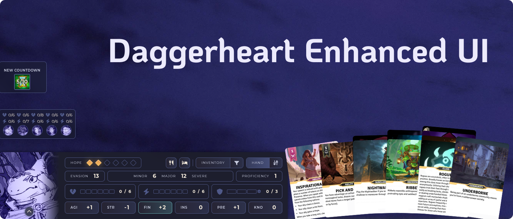
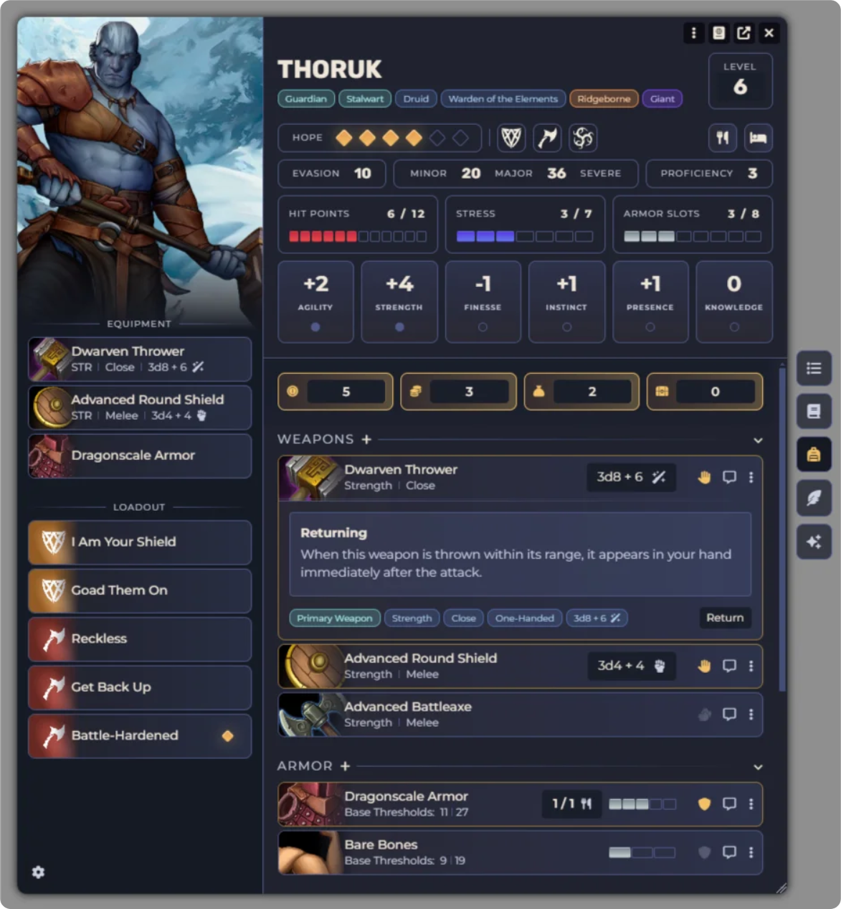
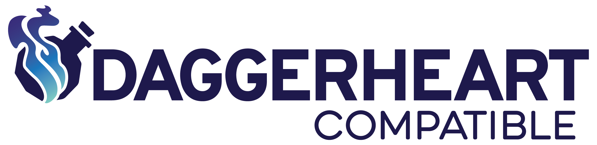

# Daggerheart Enhanced UI

## Credits

This module incorporates code and assets from other projects, restyled to match its own UI:

- **Fork base** — this repo is forked from [Daggerheart Sleek UI](https://github.com/pasoktcm/daggerheart-sleek-ui) by pasoktcm, used under its MIT license.
- **Card Hand panel** — code and visual assets ported from [Card Hand](https://github.com/Happytreedice/happytreedice-daggerheart-card-hand)
  by Happytreedice, used with the author's direct permission. That repository does not
  currently publish a LICENSE file, so this use is under informal permission rather than a
  public license — see [LICENSE](LICENSE) for details.
- **Countdown Tracker widget** — adapted from [Improved Countdowns](https://git.geeks.gay/cosmo/dh-improved-countdowns)
  by CPTN Cosmo, MIT licensed — see [LICENSE](LICENSE).

---

Alternative actor sheets with UI/UX improvements for Foundryborne's Daggerheart System

# Features

- Clean and organized layout with usability and readability improvements.
- Interactable resources (Hope, HP, Stress, Armor, item usage, etc) with left and right click to quickly manipulate their values.
- Easily readable resource pips for HP, Stress and Armor Slots that resizes based on value (respecting Daggerheart's ceiling of 12, but still great looking at higher values).
- Clickable damage thresholds to easily increase and decrease HP.
- Toggleable and persistent category headers to improve space usage when necessary.
- Better organization of basic features into Heritage, Class and Multiclass category headers.
- Better automation of the Vault, with a dedicated Recall button that increases your stress.
- Displays hope cost availability at a glance, as well as armor slots usage for each armor in your inventory.
- Sidebar equipment and loadout cards functioning as shortcuts to the corresponding domain card or item on the main sheet when clicked.
- Character description questions from DH's core rulebook sheets inside the Biography tab.
- Optional setting that changes the default sidebar's Equipment and Loadout sections with a universal Quick Access section where you can drag anything, create dividers and organize it however you want.
- Adversary, Environment, Companion and Party Sheets with similar style, layout and usability.
- Mini Sheets for Characters, Adversaries, Parties and Companions at the bottom of the screen when their token is selected, with easily reachable resources, actions and features.
- Changes to Foundryborne's default styling and chat cards.
- Visual fan of cards representing character features.
- Improved countdown widget.
- Party HP and stress overview.

# License

This module's own code is MIT licensed — see [LICENSE](LICENSE).

Daggerheart Enhanced UI is not affiliated with, endorsed by, or sponsored by Darrington Press or Critical Role.

This product includes materials from the Daggerheart System Reference Document 1.0, © Critical Role, LLC. under the terms of the Darrington Press Community Gaming (DPCGL) License, available at https://www.darringtonpress.com/license. More information can be found at https://www.daggerheart.com. There are no previous modifications by others.

Darrington Press™ and the Darrington Press authorized work logo are trademarks of Critical Role, LLC and used with permission.

# Disclaimer

This module is not built from scratch. It stands on the work of other creators — see Credits above. What's original here was built by Claude Code, under my direction.

I'm not a Software Engineer. I had ideas for tools and UI I wanted at my own table, but couldn't code them myself. I also couldn't afford hiring a human coder, so I paid for a Claude Code subscription (a manageable spend) instead, and it wrote this module under my supervision.

I don't think LLM coding is just a tool — it's a whole service, and I couldn't have released this without it. I'm generally against AI in creative work, and I recognize the hypocrisy in
that stance given what's under this module's hood — coding has its own creativity, and I owe software engineers an apology for that. I hope the creativity this module frees up at other people's tables is worth something against the cost behind how its code got written.

AI is changing the world, mostly not for the better — but it still opens doors for people trying to be fair and responsible about it.
I want to encourage you, and myself, to keep creativity human: write things, make things, share them, and remember why you're doing it.